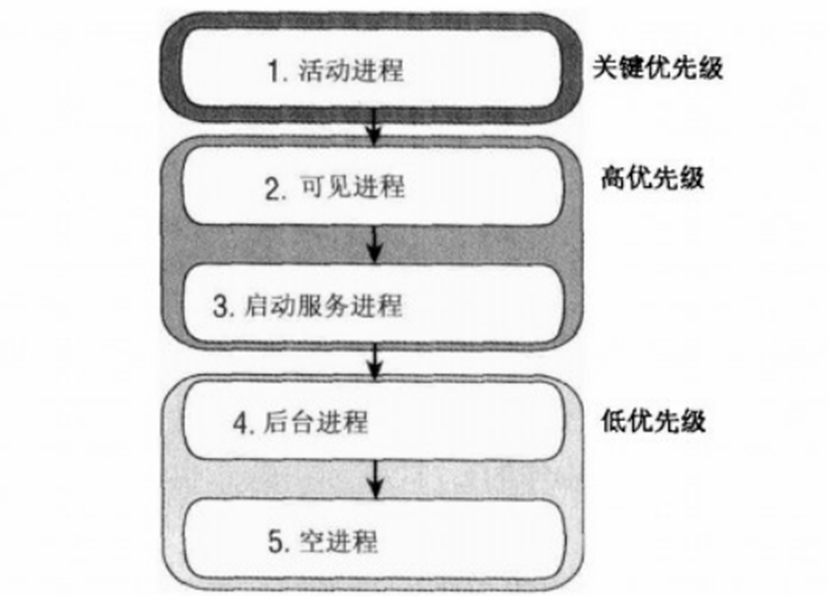
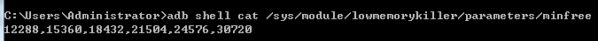

### 进程的优先级

    Android 系统将尽量长时间地保持应用进程，但为了新建进程或运行更重要的进程，需要清除旧进程来回收内存。
    为了确定保留或终止哪些进程，系统会对进程进行分类。
    需要时，系统会首先消除重要性最低的进程，然后是清除重要性稍低一级的进程，依此类推，以回收系统资源。

https://developer.android.google.cn/guide/components/processes-and-threads.html?hl=zh-cn

### Low Memory Killer

    	系统出于体验和性能上的考虑，app在退到后台时系统并不会真正的kill掉这个进程，而是将其缓存起来。
    	打开的应用越多，后台缓存的进程也越多。在系统内存不足的情况下，系统开始依据自身的一套进程回收机制来判断要kill掉哪些进程，
    	以腾出内存来供给需要的app, 这套杀进程回收内存的机制就叫 Low Memory Killer。

    cat /sys/module/lowmemorykiller/parameters/minfree

    示例:adb shell cat /sys/module/lowmemorykiller/parameters/minfree

##### 这些数字的单位是page. 1 page = 4 kb

内存阈值在不同的手机上不一样，一旦低于该值,Android便开始按顺序关闭进程. 因此Android开始结束优先级最低的空进程，即当可用内存小于180MB(46080)

### oom_adj

进程的优先级通过进程的adj值来反映，它是linux内核分配给每个系统进程的一个值，进程回收机制根据这个值来决定是否进行回收。adj的值越小，进程的优先级越高。

可以通过cat /proc/进程id/oom_adj可以看到当前进程的adj值。(需要[root]权限)

adj越大，占用内存越多会被最先kill掉，所以保活就成了降低oom_adj的值，以及如何使得我们应用占的内存最少。

    adb shell cat /proc/进程号(就是Logcat里包名后面的那个进程号)/oom_adj
    示例：adb shell cat /proc/30299/oom_adj

1、查看进程号

2、oom_adj级别

### 1、[Activity提权](https://github.com/zhaopingfu/Daemon/tree/master/app/src/main/java/com/pf/daemon/keep_activity)

### 2、[Service提权](https://github.com/zhaopingfu/Daemon/tree/master/app/src/main/java/com/pf/daemon/keep_service)

### 3、广播拉活

3.1、广播拉活

    在发生特定系统事件时，系统会发出广播，通过在 AndroidManifest 中静态注册对应的广播监听器，即可在发生响应事件时拉活。但是从android 7.0开始，对广播进行了限制，而且在8.0更加严格https://developer.android.google.cn/about/versions/oreo/background.html#broadcasts

    可静态注册广播列表：https://developer.android.google.cn/guide/components/broadcast-exceptions.html

3.2、“全家桶”拉活

    有多个app在用户设备上安装，只要开启其中一个就可以将其他的app也拉活。比如手机里装了手Q、QQ空间、兴趣部落等等，那么打开任意一个app后，其他的app也都会被唤醒。

### 4、[系统Service机制拉活](https://github.com/zhaopingfu/Daemon/tree/master/app/src/main/java/com/pf/daemon/system_service)

### 5、[帐号同步拉活](https://github.com/zhaopingfu/Daemon/tree/master/app/src/main/java/com/pf/daemon/account)

### 6、[将上面集中结合起来](https://github.com/zhaopingfu/Daemon/tree/master/process)

### 7、其他

    推送拉活
        根据终端不同，在小米手机（包括 MIUI）接入小米推送、华为手机接入华为推送。

    Native拉活
        Native fork子进程用于观察当前app主进程的存亡状态。对于5.0以上成功率极低。